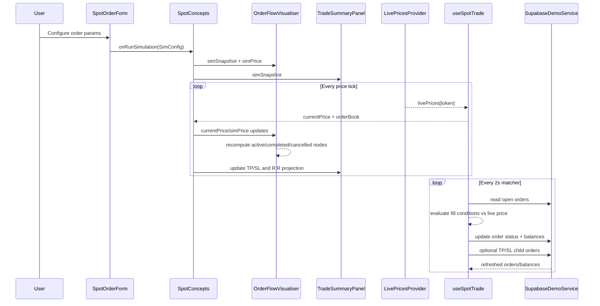
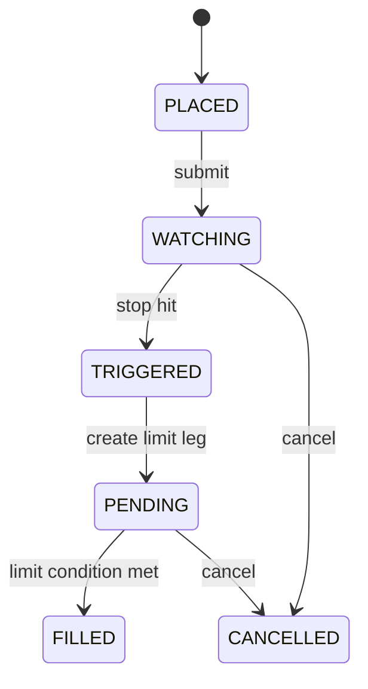
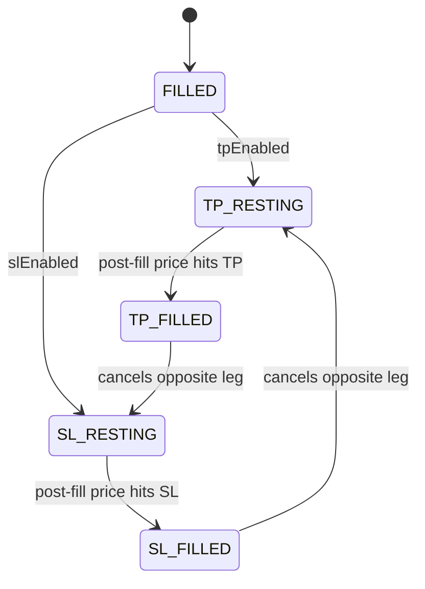
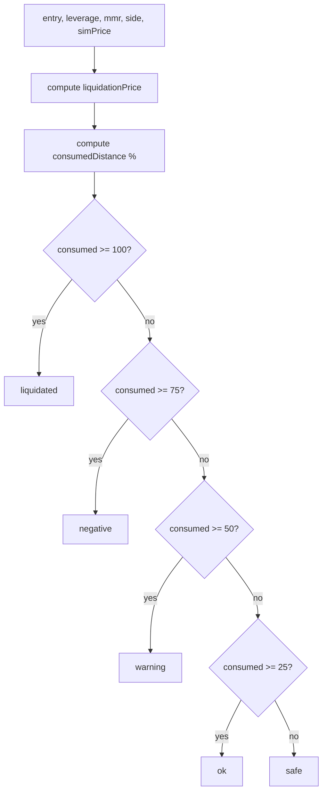

# YDEX Simulator Implementation Reference

## Scope
This document explains how the **Simulator** is implemented in the current YDEX codebase, covering:
- Spot Concepts:
  - Order simulation
  - Synthetic order book
  - Order-flow graph simulation
  - Trade summary and TP/SL projections
- Future Concepts:
  - Liquidation simulator (long/short)

It is based on the current implementation in:
- `src/app/[locale]/simulator/page.tsx`
- `src/components/features/DemoMarket.tsx`
- `src/components/features/SpotConcepts.tsx`
- `src/components/features/SpotOrderForm.tsx`
- `src/components/features/SpotOrderBook.tsx`
- `src/components/features/OrderFlowVisualiser.tsx`
- `src/components/features/TradeSummaryPanel.tsx`
- `src/components/features/FutureConcepts.tsx`
- `src/components/features/LiquidationSimulator.tsx`
- `src/components/features/ControlPanel.tsx`
- `src/components/features/CurrencySettingsModal.tsx`
- `src/lib/hooks/useSpotTrade.ts`
- `src/lib/context/LivePricesContext.tsx`
- `src/services/SupabaseDemoService.ts`
- `src/app/api/prices/route.ts`
- `supabase/migrations/003_create_demo_tables.sql`

---

## 1) Top-level Simulator Architecture

### 1.1 Route entry
- Route: `src/app/[locale]/simulator/page.tsx`
- The page renders:
  - Header block
  - `HotDexTokensPanel` (discovery feed)
  - `DemoMarket` (core simulator shell)

### 1.2 Core shell (`DemoMarket`)
`DemoMarket` is the primary simulator container and does the following:
- Wraps children in `LivePricesProvider`
- Initializes `useSpotTrade(walletAddress)` once
- Shows Spot/Future tabs (unless forced via `simulatorKind`)
- Hosts:
  - Spot tab: `SpotConcepts`
  - Future tab: `FutureConcepts`
  - Side drawer: `ControlPanel`
  - Modal: `CurrencySettingsModal`

`simulatorKind` modes:
- `undefined` => both Spot + Future tabs
- `spot` => spot-only mode (used in order type lesson)
- `futures` => futures-only mode

---

## 2) Live Price Pipeline

### 2.1 Provider
`LivePricesProvider` (`src/lib/context/LivePricesContext.tsx`):
- Opens Binance multiplex websocket stream:
  - `wss://stream.binance.com:9443/stream?streams=...@ticker`
- Tokens tracked: `SOL`, `BTC`, `ETH`, `JUP`, `BONK`, `XRP`
- On WS message:
  - Parses symbol
  - Updates buffered ref `{ price, change }`
- Flushes buffered ref to React state every 500ms

### 2.2 Fallback behavior
If WS errors:
- `wsSource` switches to `'rest'`
- Starts polling `/api/prices` every 4 seconds

### 2.3 REST endpoint
`src/app/api/prices/route.ts`:
- Fetches CoinGecko simple price API with `include_24hr_change=true`
- Maps CoinGecko IDs to token symbols
- Returns JSON shape:
```json
{
  "SOL": { "price": 123.45, "change": 2.1 },
  "BTC": { "price": 70000, "change": -1.2 }
}
```

---

## 3) Spot Concepts: Data + Execution Model

### 3.1 Main hook: `useSpotTrade`
`useSpotTrade` is the spot simulator state engine.

It owns:
- `selectedPair`
- `openOrders`, `filledOrders`, `balances`
- `settings` (currency, INR rate, manual overrides)
- `currentPrice` from live feed
- generated synthetic `orderBook`
- matching engine interval (2s)
- execution / cancellation / balance reservation logic

### 3.2 Supported order types
Defined in `SupabaseDemoService` and used in form/flow:
- `market`
- `limit`
- `stop_market`
- `stop_limit`
- `iceberg`
- `twap`
- `trailing_stop`
- `oco`

### 3.3 Fee model
- Fee constant in hook: `FEE_RATE = 0.001` (0.1%)
- Fee is usually computed as `notional * FEE_RATE`

### 3.4 Synthetic order book
`generateOrderBook(midPrice, seed)` in `useSpotTrade.ts`:
- Not exchange order book data
- Deterministic pseudo-random generation using `SimpleRNG`
- 15 ask and 15 bid levels
- Spread randomly in ~0.1% to 0.3% range
- Depth increases by level index
- Regenerates only when live price shifts >= 0.05% to reduce churn

### 3.5 Data load on wallet connect
When `walletAddress` exists:
- Initializes balances (`initializeBalances`)
- Loads open orders (`pending`, `partial`, `triggered`)
- Loads historical (`filled`, `cancelled`)
- Loads settings
- Marks overrides in `wsDisabled`

If no wallet:
- Clears orders/balances
- Disables persistence-backed behavior

### 3.6 Matching engine (2-second loop)
A `setInterval(2000)` checks open orders against current live price.

Matching rules implemented:
- `limit`:
  - buy fills when `price <= limit`
  - sell fills when `price >= limit`
- `stop_market`:
  - buy triggers/fills when `price >= stop`
  - sell triggers/fills when `price <= stop`
- `stop_limit`:
  - first move `pending -> triggered` on stop hit
  - then fill when limit condition is met
- `iceberg`:
  - fills in `visibleQty` slices
  - status `partial` until quantity done
- `twap`:
  - slices by `quantity / twapIntervals`
  - uses `twapNextSliceAt` scheduling
  - status `partial` until done

> **Important gap**: the matcher loop has **no branches** for `trailing_stop` or `oco`. Those types are only modeled in the `OrderFlowVisualiser` (visualization layer). If a `trailing_stop` or `oco` order is persisted, the matching engine will never fill it. See §9.5.

After fills:
- balance updates are applied
- TP/SL child orders can be created
- orders list and balances are refreshed

### 3.6a Trailing-stop virtual trigger (visualizer logic)
`OrderFlowVisualiser.calcVirtualTrailingStop(entry, act, pct, side, maxExtremum)`:
- An "activation" price (`act`, stored as `price` on `SimConfig`) gates entry into tracking.
  - buy side: needs `maxExtremum <= act` (price has dipped to/below activation)
  - sell side: needs `maxExtremum >= act`
- Once active, the virtual stop tracks the running extremum:
  - buy: virtual = `min(entry, maxExtremum) * (1 + pct/100)` — sits above the lowest price reached
  - sell: virtual = `max(entry, maxExtremum) * (1 - pct/100)` — sits below the highest price reached
- Fill condition (in `checkMainFilled`):
  - buy: `simPrice >= maxExtremum * (1 + pct/100)`
  - sell: `simPrice <= maxExtremum * (1 - pct/100)`
- The `tracking` node sublabel is updated live to `virtual: <price>` while active, or `wait <act>` while waiting for activation.

### 3.6b OCO first-hit-wins (visualizer logic)
`computeActiveNode` for `oco`:
- Both legs (`oco_limit`, `oco_stop`) start active in parallel.
- Whichever side hits first locks the outcome:
  - target leg hit (limit) → `limit_filled` active, `oco_stop` and `stop_filled` cancelled
  - stop leg hit → `stop_filled` active, `oco_limit` and `limit_filled` cancelled
- Kill-edges in `OCO_FLOW` (`limit_filled -> oco_stop` and `stop_filled -> oco_limit`, both dashed) visualize the cancellation of the losing leg.
- When TP+SL are both attached to a parent fill, the same first-hit-wins kill pattern is added by `buildTpSlExtension`: `tp_filled -> sl_order` and `sl_filled -> tp_order` as `cancels` edges.

### 3.7 Balance reservation and release
At order placement:
- Buy pending orders reserve USDC in `in_order`
- Sell pending orders reserve base token in `in_order`
- Market orders apply immediate balance movement

At cancellation:
- Remaining reserved funds/tokens are moved back to `available`

### 3.8 TP/SL children
When a parent fills:
- TP creates a child `limit` order on opposite side
- SL creates a child `stop_market` order on opposite side
- Child link via `parent_order_id`

---

## 4) Spot Concepts UI Composition

### 4.1 `SpotConcepts`
Contains:
- Pair selector dropdown
- live price + WS status badge
- control panel button
- sub-tabs:
  - Order Simulator
  - Order Book

`Order Book` tab:
- `SpotOrderBook` with synthetic bids/asks

`Order Simulator` tab layout:
1. `SpotOrderForm`
2. `OrderFlowVisualiser`
3. Vertical price scrubber (sim price)
4. `TradeSummaryPanel`

### 4.2 Spot form behavior (`SpotOrderForm`)
- Dynamic inputs by order type
- BUY/SELL toggle
- Validation rules for:
  - stop/limit directional correctness
  - OCO constraints
  - trailing constraints
  - TP/SL consistency relative to entry
  - visible qty vs amount
- `RUN SIMULATION` is blocked on invalid config

Simulation payload emitted as `SimConfig` and consumed by flow and summary components.

### 4.3 Order book view (`SpotOrderBook`)
- Asks (reversed) above spread
- Bids below spread
- Depth bars width = cumulative total / max total
- Price click callback exists but current parent passes no-op

### 4.4 Order-flow graph (`OrderFlowVisualiser`)
- Defines static state-machine graphs per order type
- Adds TP/SL extension graph when enabled
- Applies runtime labels (prices, triggers, outcomes)
- Computes node state classes:
  - skeleton
  - active
  - completed
  - future
  - cancelled
  - position
  - filled_terminal

#### Important mechanics
- Uses **session min/max latching** so fill conditions stay true once crossed
- Uses **post-fill min/max** for TP/SL evaluation (after main fill)
- Trailing stop uses virtual trigger based on extremum and trailing percent (see §3.6a)
- OCO legs run in parallel; first hit cancels the other (see §3.6b)
- Supports zoom and drag-to-pan in SVG canvas

#### Per-order-type flow graphs
Defined in `OrderFlowVisualiser.tsx` and selected by `FLOW_MAP[orderType]`:
- `MARKET_FLOW` — placed → filled
- `LIMIT_FLOW` — placed → pending → filled (or → cancel)
- `STOP_MARKET_FLOW` — placed → watching → filled
- `STOP_LIMIT_FLOW` — placed → watching → triggered → pending → filled
- `ICEBERG_FLOW` — placed → slice (loop) → filled
- `TWAP_FLOW` — placed → interval (loop) → partial → filled
- `TRAILING_STOP_FLOW` — placed → tracking (self-loop `trail`) → triggered → filled
- `OCO_FLOW` — placed → {oco_limit, oco_stop} (parallel) → {limit_filled | stop_filled} with `kills` edges to the losing leg
- `buildTpSlExtension(tpEnabled, slEnabled)` appends `tp_order/tp_filled` and/or `sl_order/sl_filled` nodes onto whichever base graph is active.

### 4.5 Trade summary (`TradeSummaryPanel`)
- Shows snapshot of order type/side/entry/amount
- Computes TP and SL scenario PnL
- Computes risk/reward ratio when both TP+SL exist
- Shows educational expandable block

P&L formula used:
- For buy: `exit - entry`
- For sell: `entry - exit`
- `total = pricePerUnit * amount`
- `pct = pricePerUnit / entry * 100`

---

## 5) Future Concepts: Liquidation Simulator

### 5.1 Container
`FutureConcepts` currently has 3 sections:
- Liquidation (enabled)
- Funding Rate (disabled placeholder)
- Leverage (disabled placeholder)

### 5.2 Liquidation simulator inputs
`LiquidationSimulator` takes:
- live prices map
- display currency (`USD`/`INR`)
- `usdInrRate`

Interactive inputs:
- Token (fixed as XRP/USDC)
- Quantity
- Leverage (1x–100x slider)
- Maintenance Margin Rate (MMR %)
- Position side (Long/Short)

### 5.3 Core formulas
Implemented formulas:

Long liquidation:
- `liq = entry * (1 - 1/leverage + mmr)`

Short liquidation:
- `liq = entry * (1 + 1/leverage - mmr)`

Margin required:
- `initialMargin = quantity * entry / leverage`

PnL:
- long: `qty * (simPrice - entry)`
- short: `qty * (entry - simPrice)`

Effective margin:
- `initialMargin + pnl`

ROE:
- `pnl / initialMargin * 100`

Distance consumed:
- percentage of path from entry toward liquidation already consumed

Status tiers:
- `safe`, `ok`, `warning`, `negative`, `liquidated`

### 5.4 Vertical price scrubber
- Slider range auto-expands to include liquidation line
- Includes entry line + liquidation line + draggable knob
- Supports mouse + touch drag
- Recomputes all metrics live

### 5.5 INR conversion
- Display conversion only
- `convert(n) = n * usdInrRate` when INR
- Spot remains USD-only in messaging

---

## 6) Control Surfaces Around Simulator

### 6.1 Control panel drawer
`ControlPanel`:
- Opens as bottom sheet (mobile) / right drawer (desktop)
- Per-token manual override inputs and quick ±5% buttons
- Reset all overrides
- Reset balances to defaults

### 6.2 Currency settings modal
`CurrencySettingsModal`:
- Edit USD/INR rate manually
- Quick preset buttons
- “Reset to Live Rate” via Frankfurter API (`USD -> INR`)

---

## 7) Persistence Layer (Supabase)

### 7.1 Service class
`SupabaseDemoService` encapsulates:
- balances CRUD
- orders CRUD and transitions
- settings CRUD

### 7.2 Tables (migration 003)
- `demo_balances`
- `demo_settings`
- `demo_orders`

With:
- `updated_at` triggers
- indices for order queries
- status-driven filtering

### 7.3 Default balances
Hardcoded defaults include:
- USDC, SOL, BTC, ETH, JUP, BONK, XRP

### 7.4 Offline/no-env behavior
If Supabase env vars are absent:
- `isSupabaseConfigured()` false
- service methods return defaults/empty in many read paths
- write paths may no-op or throw based on method

---

## 8) Lessons Integration

### 8.1 Order Type lesson
`OrderTypeLesson` embeds `DemoMarket simulatorKind="spot"`:
- full spot simulator inside lesson context
- user practices order lifecycle directly

### 8.2 Order Book lesson
`OrderBookLesson` uses `InteractiveOrderBook` component (separate educational order book path), not the main `DemoMarket` shell.

---

## 9) Data/Behavior Notes and Current Gaps

These are current implementation realities to be aware of:

1. Synthetic vs real order book
- Main simulator order book (`SpotOrderBook`) is synthetic, generated locally.
- It does not stream exchange depth.

2. Manual price override wiring (dead-end persisted state)
- `ControlPanel` writes `settings.priceOverrides` (per-token).
- `useSpotTrade` reads those overrides on load and sets `wsDisabled[token] = true` for visual badging.
- `LivePricesProvider.flushInterval` always emits `isOverridden: false` regardless of any override state. The `isOverridden` flag is in the `PriceData` shape but never gets set to `true`.
- `useSpotTrade.currentPrice` reads `livePrices[token]` directly with no merge.
- Net effect: overrides are persisted to Supabase and reflected in `wsDisabled` UI hints, but **not** consumed by the matching engine, the price scrubber, or any displayed price. The override path is currently inert.

3. Schema drift risk for order types
- `SupabaseDemoService` supports `trailing_stop` and `oco`.
- Migration `003_create_demo_tables.sql` check constraint only includes up to `twap`.
- If DB constraints are not updated elsewhere, inserts for newer types may fail.

4. TWAP setup variable
- In `executeTrade`, `adjustedParams` and `firstSlice` setup code exists, but `firstSlice` isn’t persisted from that local variable directly.

5. Matcher loop missing trailing_stop / oco branches
- `useSpotTrade` matcher loop only handles: `limit`, `stop_market`, `stop_limit` (pending → triggered → fill), `iceberg`, `twap`.
- There are no branches for `trailing_stop` or `oco`. If a row of either type lands in `demo_orders` with status `pending`, the engine will never fill it.
- Combined with §9.3 (DB CHECK constraint also rejects these types), the trailing-stop/OCO flows currently exist only as visualizer state machines, not executable orders.

6. Verification checklist item drift
- §13 says "Slider status tiers (`safe -> liquidated`) align with consumed distance" — confirmed in `LiquidationSimulator.getStatus()` with thresholds 25/50/75/100.
- §13 says "`trailing_stop` and `oco` are allowed by DB constraints" — currently false (see §9.3, §9.5).
- §13 says "Manual override path is explicitly merged into effective price source" — currently false (see §9.2).

---

## 10) End-to-End Spot Simulation Flow (Sequence)

1. User opens simulator page.
2. `DemoMarket` mounts under `LivePricesProvider`.
3. `useSpotTrade` initializes state and loads Supabase data (if wallet connected).
4. Live price arrives from WS (or REST fallback).
5. User configures order in `SpotOrderForm`.
6. User presses `RUN SIMULATION`.
7. `SimConfig` is passed to:
   - `OrderFlowVisualiser` (state-machine visualization)
   - `TradeSummaryPanel` (P&L scenario projection)
8. User drags price scrubber in spot panel:
   - Graph transitions and summary numbers update
9. If user executes real simulated trade path (through hook actions):
   - balances reserve/update
   - order status changes via matching engine
   - TP/SL child orders can be created

---

## 11) End-to-End Futures Liquidation Flow

1. User opens Future Concepts tab.
2. User sets quantity, leverage, MMR, side.
3. User clicks `RUN SIMULATION`.
4. Component computes liquidation price and margin baseline.
5. User drags vertical price slider.
6. Component recomputes:
   - position value
   - PnL
   - effective margin
   - ROE
   - liquidation distance and status
7. Status bar and marker update continuously.

---

## 12) Quick File Responsibility Map

- Route shell: `src/app/[locale]/simulator/page.tsx`
- Simulator shell/tabs: `src/components/features/DemoMarket.tsx`
- Spot page composition: `src/components/features/SpotConcepts.tsx`
- Spot order input/validation: `src/components/features/SpotOrderForm.tsx`
- Spot synthetic depth UI: `src/components/features/SpotOrderBook.tsx`
- Spot flow graph engine: `src/components/features/OrderFlowVisualiser.tsx`
- Spot outcome analytics: `src/components/features/TradeSummaryPanel.tsx`
- Future tab container: `src/components/features/FutureConcepts.tsx`
- Liquidation simulator: `src/components/features/LiquidationSimulator.tsx`
- Live prices WS/REST: `src/lib/context/LivePricesContext.tsx`
- Spot matching + balances: `src/lib/hooks/useSpotTrade.ts`
- Persistence adapter: `src/services/SupabaseDemoService.ts`
- REST fallback price API: `src/app/api/prices/route.ts`
- DB schema baseline: `supabase/migrations/003_create_demo_tables.sql`

---

## 13) Verification Checklist (for future refactors)

- [ ] Spot tab renders both Order Simulator and Order Book views
- [ ] Flow graph transitions for each order type are still correct
- [ ] TP/SL post-fill behavior remains path-dependent
- [ ] Matching loop (2s) still handles limit/stop/iceberg/twap branches
- [ ] Balance reservation/release invariants hold on create/cancel/fill
- [ ] Liquidation formulas unchanged (long vs short)
- [ ] Slider status tiers (`safe -> liquidated`) align with consumed distance
- [ ] `trailing_stop` and `oco` are allowed by DB constraints
- [ ] Manual override path is explicitly merged into effective price source


---

## 14) Mermaid Diagrams (Price-Reactive Behavior)

### 14.1 Spot simulator runtime sequence (price-driven)


### 14.2 Order flow state progression (example: Stop-Limit)


### 14.3 TP/SL extension after main fill


### 14.4 Liquidation status evaluation ladder


---

## 15) Key Code Snippets (Exact Logic)

### 15.1 Liquidation formulas
```ts
function calcLiquidationPrice(entry: number, leverage: number, mmr: number, side: PositionSide): number {
    if (side === 'long') {
        return entry * (1 - 1 / leverage + mmr);
    }
    return entry * (1 + 1 / leverage - mmr);
}

function calcDistanceConsumed(entry: number, sim: number, liq: number, side: PositionSide): number {
    const totalDist = Math.abs(entry - liq);
    if (totalDist === 0) return 100;

    let consumed: number;
    if (side === 'long') {
        consumed = Math.max(0, entry - sim);
    } else {
        consumed = Math.max(0, sim - entry);
    }
    return (consumed / totalDist) * 100;
}
```

### 15.2 Flow-state reaction to price levels (excerpt)
```ts
case 'limit': {
    const filled = side === 'buy' ? sessionMin <= lp : sessionMax >= lp;
    if (filled) {
        mainFilled = true;
        completedIds = ['placed', 'pending'];
        activeIds = ['filled'];
    } else {
        completedIds = ['placed'];
        activeIds = ['pending'];
    }
    break;
}

case 'stop_market': {
    const triggered = side === 'buy' ? sessionMax >= sp : sessionMin <= sp;
    if (triggered) {
        mainFilled = true;
        completedIds = ['placed', 'watching', 'triggered'];
        activeIds = ['filled'];
    } else {
        completedIds = ['placed'];
        activeIds = ['watching'];
    }
    break;
}
```

### 15.3 OCO branch resolution (first hit wins)
```ts
case 'oco': {
    const targetHit = side === 'buy' ? sessionMin <= lp : sessionMax >= lp;
    const stopHit = side === 'buy' ? sessionMax >= sp : sessionMin <= sp;

    if (targetHit) {
        mainFilled = true;
        completedIds = ['placed', 'oco_limit'];
        activeIds = ['limit_filled'];
        cancelledIds = ['oco_stop', 'stop_filled'];
    } else if (stopHit) {
        mainFilled = true;
        completedIds = ['placed', 'oco_stop'];
        activeIds = ['stop_filled'];
        cancelledIds = ['oco_limit', 'limit_filled'];
    } else {
        completedIds = ['placed'];
        activeIds = ['oco_limit', 'oco_stop'];
    }
    break;
}
```

### 15.4 Post-fill TP/SL detection uses post-fill extrema
```ts
const tpSlMin = orderType === 'twap' ? sessionMin : postFillMin;
const tpSlMax = orderType === 'twap' ? sessionMax : postFillMax;

const tpHit = tpEnabled && tpPrice !== null &&
    (side === 'buy' ? tpSlMax >= tpPrice : tpSlMin <= tpPrice);
const slHit = slEnabled && slPrice !== null &&
    (side === 'buy' ? tpSlMin <= slPrice : tpSlMax >= slPrice);
```

### 15.5 Session extrema latching (why graph reacts to touched levels)
```ts
if (simSnapshot !== prevSnap) {
    setSavedMin(simPrice);
    setSavedMax(simPrice);
    setSavedPostFillMin(simPrice);
    setSavedPostFillMax(simPrice);
    setWasMainFilled(false);
} else {
    if (simPrice < sessionMin) sessionMin = simPrice;
    if (simPrice > sessionMax) sessionMax = simPrice;
}
```

### 15.6 Price matcher loop (order execution engine)
```ts
const interval = setInterval(async () => {
    const orders = openOrdersRef.current;
    const prices = livePricesStateRef.current;

    for (const order of orders) {
        if (order.status === 'cancelled' || order.status === 'filled') continue;
        const token = order.pair.split('/')[0] as DemoToken;
        const price = prices[token]?.price;
        if (!price || price <= 0) continue;

        // Implemented branches: limit, stop_market, stop_limit (pending→triggered→fill),
        // iceberg (visibleQty slices), twap (twapNextSliceAt scheduling).
        // NOT implemented: trailing_stop, oco (visualizer-only — see §9.5).
    }
}, 2000);
```

### 15.8 Trailing-stop virtual trigger (visualizer)
```ts
function calcVirtualTrailingStop(
    entry: number, act: number, pct: number,
    side: 'buy' | 'sell', maxExtremum: number,
): number | null {
    if (side === 'buy' && act > 0 && maxExtremum > act) return null;
    if (side === 'sell' && act > 0 && maxExtremum < act) return null;

    const ratio = pct / 100;
    if (side === 'buy') {
        const nadir = Math.min(entry, maxExtremum);
        return nadir * (1 + ratio);
    } else {
        const apex = Math.max(entry, maxExtremum);
        return apex * (1 - ratio);
    }
}

// In checkMainFilled:
case 'trailing_stop': {
    const act = lp ?? ep;
    const activated = side === 'buy' ? sessionMin <= act : sessionMax >= act;
    if (!activated) return false;
    const pct = (sp ?? 0) / 100;
    const vt = side === 'buy'
        ? maxExtremum * (1 + pct)
        : maxExtremum * (1 - pct);
    return side === 'buy' ? simPrice >= vt : simPrice <= vt;
}
```

### 15.7 Vertical slider conversion (used in both Spot/Futures)
```ts
const priceToPercent = (price: number) => {
    const { min, max } = sliderRange;
    return ((max - price) / (max - min)) * 100;
};

const percentToPrice = (pct: number) => {
    const { min, max } = sliderRange;
    return max - (pct / 100) * (max - min);
};
```

---

## 16) Diagram-to-Code Mapping

- Mermaid `stateDiagram` for Stop-Limit maps to `computeActiveNode()` stop-limit case in `OrderFlowVisualiser.tsx`.
- Mermaid TP/SL branch maps to TP/SL extension in `buildTpSlExtension()` and TP/SL hit logic in `computeActiveNode()`.
- Liquidation ladder maps to `calcDistanceConsumed()` + `getStatus()` in `LiquidationSimulator.tsx`.
- Sequence diagram matcher loop maps to `useSpotTrade` interval logic and `SupabaseDemoService` updates (limit / stop_market / stop_limit / iceberg / twap branches only — see §9.5).
- Trailing-stop tracking arc maps to `TRAILING_STOP_FLOW` graph + `calcVirtualTrailingStop()` (§3.6a, §15.8).
- OCO first-hit-wins maps to `OCO_FLOW` kill-edges + the `oco` case in `computeActiveNode()` (§3.6b, §15.3).

